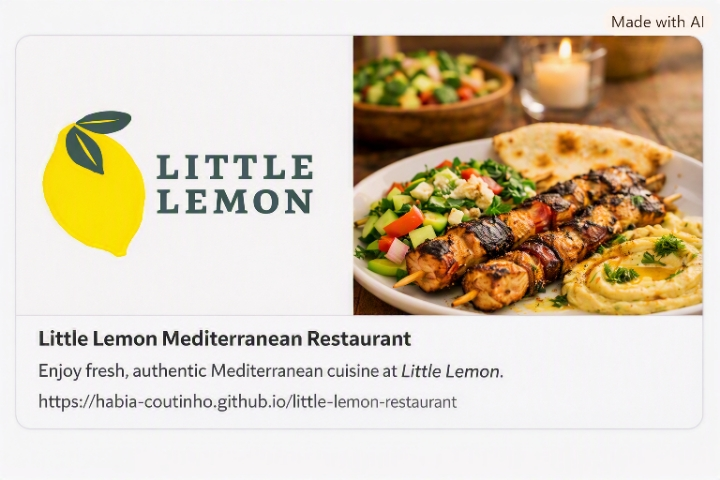

# 🍋 Little Lemon — Restaurant Home Page

A responsive restaurant home page developed as the portfolio project for the **HTML and CSS in Depth** course from the **Meta Front-End Developer Professional Certificate** on Coursera.

The project was created for the fictional restaurant **Little Lemon**, a family-owned Mediterranean restaurant in Chicago, Illinois, inspired by Italian, Greek, and Turkish cuisine.

---

## 🌐 Live Demo

🔗 **[Visit Little Lemon](https://habia-coutinho.github.io/little-lemon-restaurant/)**

---

## 📸 Preview



---

## 📖 About the Project

Little Lemon is a fictional family-owned Mediterranean restaurant founded by Italian brothers **Mario and Adrian**.

Mario is the restaurant's chef and brings traditional family recipes and his experience from Italy. Adrian is responsible for marketing and helped expand the menu with Greek and Turkish influences.

The goal of this project was to create an engaging, accessible, and responsive home page that reflects the restaurant's identity while applying the HTML and CSS concepts learned throughout the course.

---

## 🎯 Project Goals

The website was designed to:

- Present the Little Lemon restaurant and its story
- Highlight seasonal dishes and Mediterranean flavors
- Encourage customers to make reservations
- Provide contact information and opening hours
- Create a welcoming and visually appealing experience
- Apply semantic HTML and modern CSS techniques
- Provide a responsive experience across different screen sizes

---

## 🧩 Page Structure

The home page is organized into the following sections:

### Header

Contains:

- Little Lemon logo
- Main navigation
- Links to Home, Highlights, About, and Contact

### Hero

The main promotional section featuring:

- Restaurant introduction
- Mediterranean food photography
- Call-to-action for table reservations

### Highlights

Three featured cards showcasing:

1. **Seasonal Dishes**
2. **Mediterranean Flavors**
3. **A Welcoming Experience**

### About Little Lemon

Introduces the restaurant's founders and tells the story behind the family-owned business.

### Contact

Provides:

- Phone number
- Address
- Opening hours

### Footer

Contains the Little Lemon logo and copyright information.

---

## 🎨 Design System

The visual identity was created around the colors associated with Little Lemon's branding.

| Role | Color |
|---|---|
| Primary | `#495E57` |
| Secondary | `#F4CE14` |
| Accent | `#EE9972` |
| Background | `#FAF8F5` |
| Surface | `#EDEFEE` |
| Text | `#333333` |

### Typography

**Markazi Text**  
Used for headings and titles.

**Karla**  
Used for body text and interface elements.

The combination was chosen to balance a classic, elegant restaurant feeling with modern readability.

---

## 📱 Responsive Design

The website follows a **mobile-first approach** and adapts to different screen sizes.

### Mobile
- Single-column content
- Stacked navigation
- Stacked hero content
- One-column highlight cards
- Vertical About section

### Tablet
- Adapted navigation
- Multi-column highlight layout
- Flexible spacing and sizing

### Desktop
- Horizontal header with logo and navigation
- Large promotional hero
- Three-column highlights section
- Two-column About section
- Two-column footer

CSS media queries were used to adapt the layout and maintain usability across devices.

---

## ♿ Accessibility

Accessibility was considered throughout the project.

The website includes:

- Semantic HTML elements
- Proper heading hierarchy
- Descriptive `alt` text for images
- Accessible navigation
- Keyboard-focus states
- Visible focus indicators
- Appropriate color contrast
- Descriptive link text
- `lang="en-US"` document language

---

## 🔎 SEO

The project also includes basic SEO and social sharing metadata:

- Descriptive `<title>`
- Meta description
- Meta author
- Robots metadata
- Responsive viewport metadata
- Open Graph metadata
- Favicon
- Semantic HTML structure

---

## 🛠️ Technologies

- HTML5
- CSS3
- CSS Flexbox
- CSS Grid
- CSS Media Queries
- Google Fonts
- Git
- GitHub
- GitHub Pages

---

## ✨ CSS Features

The project makes use of several CSS techniques, including:

- CSS custom properties
- Flexbox
- CSS Grid
- Responsive media queries
- Relative units such as `rem` and `%`
- Transitions
- Hover states
- Focus states
- Active states
- Border radius
- Box shadows
- Responsive images

---

## 📂 Project Structure

```text
little-lemon-restaurant/
│
├── index.html
├── style.css
│
├── assets/
│   └── images/
│       ├── logo.png
│       ├── logo-footer.png
│       ├── favicon.ico
│       ├── banner.png
│       ├── seasonal-dishes.jpg
│       ├── mediterranean-flavors.jpg
│       ├── a-welcoming-experience.jpg
│       ├── founders-of-Little-Lemon.jpg
│       └── little-lemon-preview-card.jpg
│
└── README.md

```
---
## 🎓 Course

This project was developed as part of the:

**Meta Front-End Developer Professional Certificate**

The project allowed me to apply concepts related to:

- HTML structure and semantics
- CSS styling
- Responsive layouts
- Flexbox
- CSS Grid
- Accessibility
- SEO
- Git and GitHub
- Web development best practices

---

## 🚀 Deployment

The website is deployed using **GitHub Pages**.

Every change can be committed and pushed to the repository, allowing the live version of the project to be updated through the GitHub Pages deployment.

---

## 👩‍💻 Author

**Hábia Coutinho**

Front-End Development Student

Interested in:

- Front-End Development
- Web Development
- UI/UX
- Accessibility
- Responsive Design

---

## 📄 License

This project was created for educational and portfolio purposes as part of the **Meta Front-End Developer Professional Certificate** on Coursera.
